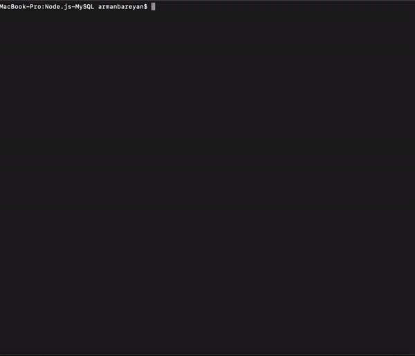

# Node.js-MySQL

## BAMAZON

The app take in orders from customers and deplete stock from the store's inventory

## Challenge #1: Customer View

* The first message asks the customers the ID of the product they would like to buy

* The second one asks the customers how many units of the product they would like to buy

* After that, (if your store has enough of the product) the application will show the customer the total cost of his purchase and refresh the database

## Challenge #2: Manager View

* The first message, "View Products for Sale", shows to the manager the list every item even if quantity is 0

* The second message, "View Low Inventory", shows to the manager list all items with an inventory count lower than he/she wants to see.

* Next message, "Add to Inventory", allow the manager to add inventory

* The last one, "Add New Product", allow the manager to add a completely new product to the store. 

## Challenge #3: Supervisor View 

* The first message, "View Product Sales by Departmen", shows to the supervisor the list of deparments with over head costs, product sales, and total profit.

* Next message, "Create New Department", allow the supervisor to add deparments

## Using

* JavaScript
* NodeJS
* MySQL
* NPM 
    * mysql
    * inquirer
    * cli-table

## Author

* **Arman Bareyan** [ABareyan](https://github.com/ABareyan)

## License

No license agreements. 